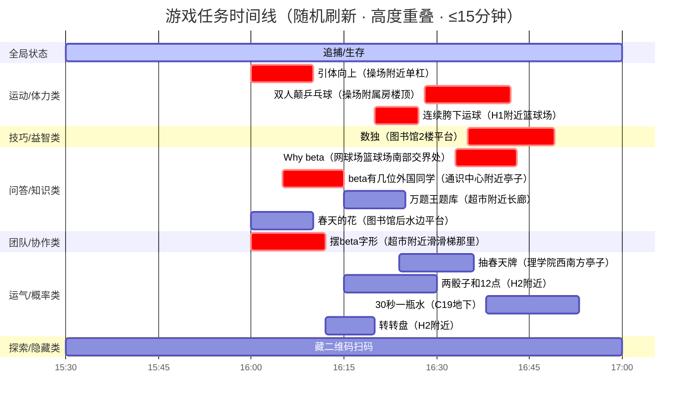

# 时间线

## 总任务设置时间线

>[!tip]
>红色示意设置安全区

```mermaid
gantt
    title 游戏任务时间线（随机刷新 · 高度重叠 · ≤15分钟）
    dateFormat HH:mm
    axisFormat %H:%M

    section 全局状态
    追捕/生存 :active, 15:30, 90m

    section 运动/体力类
    引体向上（操场附近单杠）            :crit, 16:00, 10m
    双人颠乒乓球（操场附属房楼顶）         :crit, 16:28, 14m
    连续胯下运球（H1附近篮球场）   	  :crit, 16:20, 7m

    section 技巧/益智类
    数独（图书馆2楼平台）           :crit, 16:35, 14m

    section 问答/知识类
    Why beta（网球场篮球场南部交界处）			:crit, 16:33, 10m
    beta有几位外国同学（通识中心附近亭子）     :crit, 16:05, 10m
    万题王题库（超市附近长廊）     		:16:15, 10m
    春天的花（图书馆后水边平台）       		:16:00, 10m

    section 团队/协作类
    摆beta字形（超市附近滑滑梯那里）          :crit, 16:00, 12m

    section 运气/概率类
    抽春天牌（理学院西南方亭子）            :16:24, 12m
    两骰子和12点（H2附近）        :16:15, 15m
    30秒一瓶水（C19地下）          :16:38, 15m
    转转盘（H2附近）              :16:12, 8m

    section 探索/隐藏类
    藏二维码扫码         :15:30, 90m

```

