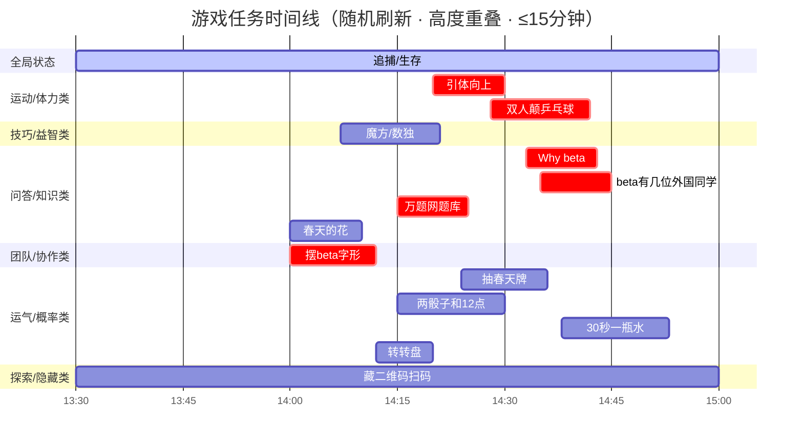
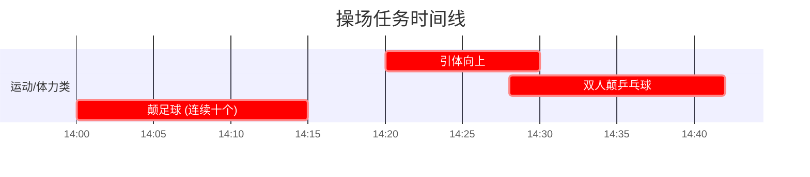
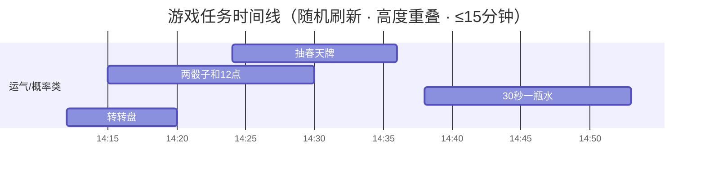

# 时间线

## 总任务设置时间线

>[!tip]
>红色示意设置安全区

```mermaid
gantt
    title 游戏任务时间线（随机刷新 · 高度重叠 · ≤15分钟）
    dateFormat HH:mm
    axisFormat %H:%M

    section 全局状态
    追捕/生存 :active, 13:30, 90m

    section 运动/体力类
    引体向上            :crit, 14:20, 10m
    双人颠乒乓球         :crit, 14:28, 14m

    section 技巧/益智类
    魔方/数独           :14:07, 14m

    section 问答/知识类
    Why beta			:crit, 14:33, 10m
    beta有几位外国同学     :crit, 14:35, 10m
    万题网题库     		:crit, 14:15, 10m
    春天的花       		:14:00, 10m

    section 团队/协作类
    摆beta字形          :crit, 14:00, 12m

    section 运气/概率类
    抽春天牌            :14:24, 12m
    两骰子和12点        :14:15, 15m
    30秒一瓶水          :14:38, 15m
    转转盘              :14:12, 8m

    section 探索/隐藏类
    藏二维码扫码         :13:30, 90m

```

## 任务点时间线

### 操场

```mermaid
gantt
    title 操场任务时间线
    dateFormat HH:mm
    axisFormat %H:%M

    section 运动/体力类
    引体向上            :crit, 14:20, 10m
    双人颠乒乓球         :crit, 14:28, 14m
    颠足球 (连续十个)			  :crit, 14:00, 15m

```

### C19

```mermaid
gantt
    title 游戏任务时间线（随机刷新 · 高度重叠 · ≤15分钟）
    dateFormat HH:mm
    axisFormat %H:%M

    section 运气/概率类
    抽春天牌            :14:24, 12m
    两骰子和12点        :14:15, 15m
    30秒一瓶水          :14:38, 15m
    转转盘              :14:12, 8m

```
