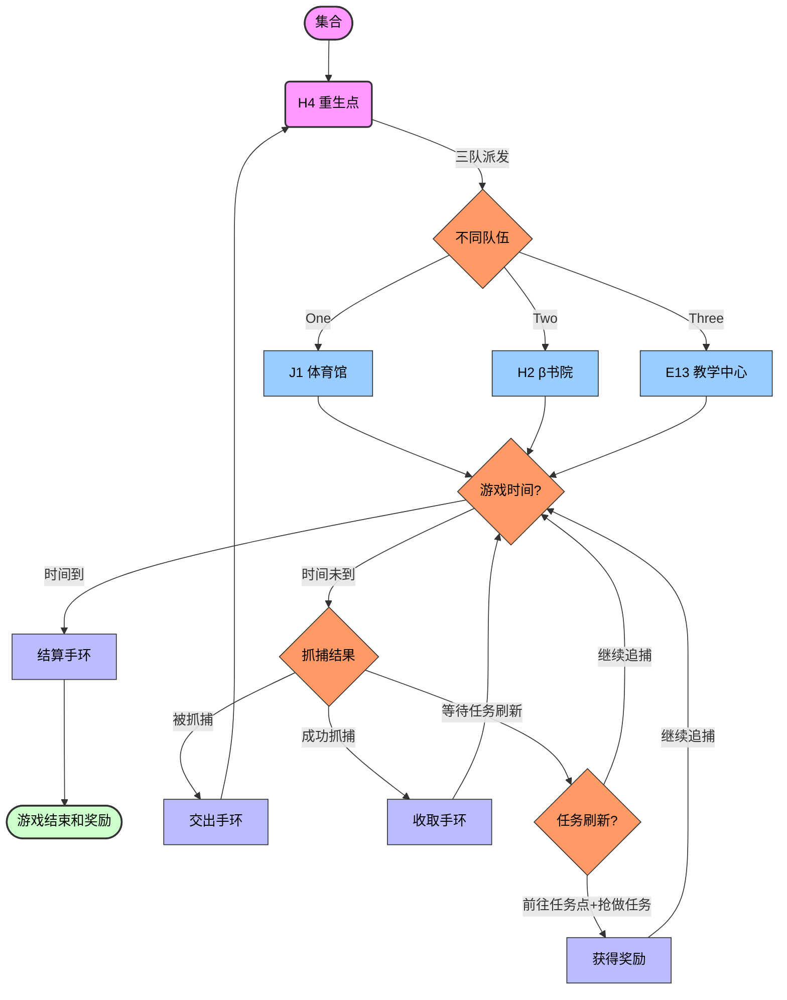

# 预演流程

```mermaid
flowchart TD
    %% 起点
    Start([集合]) --> Respawn(H4 重生点)

    %% 队伍分派
    Respawn -->|三队派发| TeamSplit{不同队伍}
    TeamSplit -->|One| Pos1[J1 体育馆]
    TeamSplit -->|Two| Pos2[H2 β书院]
    TeamSplit -->|Three| Pos3[E13 教学中心]

    %% 所有队伍进入游戏主循环
    Pos1 --> GameLoop
    Pos2 --> GameLoop
    Pos3 --> GameLoop

    %% 游戏时间判断（核心节点）
    GameLoop{游戏时间?}

    %% 时间到 → 游戏结束，结算
    GameLoop -->|时间到| Settle[结算手环]
    Settle --> EndGame([游戏结束和奖励])

    %% 时间未到 → 继续游戏（抓捕/任务分支）
    GameLoop -->|时间未到| Catch{抓捕结果}

    %% 被抓捕：交出手环 → 重生点（回到队伍分派前？需明确）
    Catch -->|被抓捕| GiveBand[交出手环]
    GiveBand --> Respawn

    %% 成功抓捕：收取手环 → 回到游戏时间判断
    Catch -->|成功抓捕| TakeBand[收取手环]
    TakeBand --> GameLoop

    %% 等待任务刷新分支
    Catch -->|等待任务刷新| TaskWait{任务刷新?}
    
    TaskWait -->|前往任务点+抢做任务| Reward[获得奖励]
    Reward -->|继续追捕| GameLoop
    
    TaskWait -->|继续追捕| GameLoop

    %% 样式
    classDef startEnd fill:#f9f,stroke:#333,stroke-width:2px,color:black
    classDef process fill:#bbf,stroke:#333,stroke-width:1px,color:black
    classDef decision fill:#f96,stroke:#333,stroke-width:1px,color:black
    classDef location fill:#9cf,stroke:#333,stroke-width:1px,color:black
    classDef endNode fill:#cfc,stroke:#333,stroke-width:2px,color:black

    class Start,Respawn startEnd
    class GiveBand,TakeBand,Reward,Settle process
    class TeamSplit,GameLoop,Catch,TaskWait decision
    class Pos1,Pos2,Pos3 location
    class EndGame endNode
```